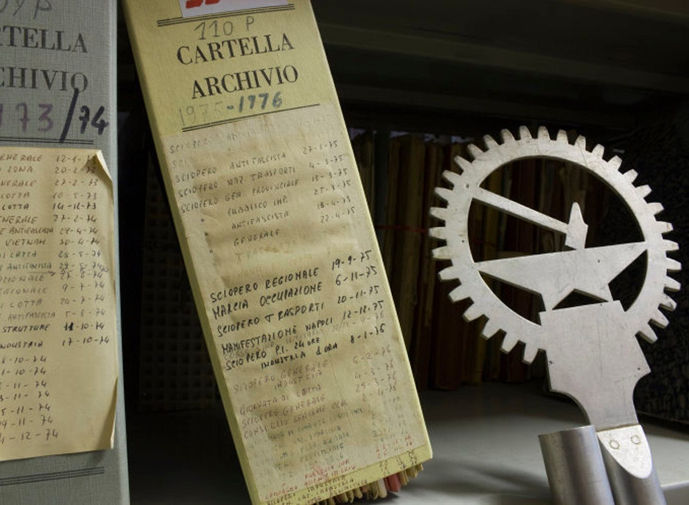

## Archivio storico UDI Bologna 

L’Archivio dell'Unione Donne in Italia (Udi) conserva presso la sua sede bolognese alcuni complessi archivistici di particolare importanza per ricostruire la storia dell’Associazione e dell’emancipazione femminile in generale, tra questi il Fondo Unione Donne in Italia (Udi) Bologna, il fondo fotografico ad esso afferente e il Fondo Unione Donne in Italia (Udi) Comitato regionale Emilia-Romagna. 

La storia dell’archivio nel suo complesso è legata all'istituzione del cosiddetto “Gruppo Archivio” avvenuta nel luglio 1987. Similmente a quanto si stava compiendo a livello nazionale, il Gruppo Archivio bolognese iniziò la ricognizione della documentazione già in possesso dell'Associazione e, parallelamente, si propose di reperirne dell‘altra, attraverso la richiesta diretta rivolta a circoli della provincia bolognese e singole attiviste. Nel giugno 1991, l’Archivio venne dichiarato "di notevole interesse storico" dalla Sovrintendenza archivistica e bibliografica dell’Emilia-Romagna e aprì le porte al pubblico il 7 giugno 1991, dopo un percorso pluriennale ispirato da più ampi mutamenti avvenuti a livello nazionale.

Il Fondo fotografico dell’UDI di Bologna, è costituito da oltre 3.000 fotografie che documentano iniziative e attività organizzate e sostenute dall'UDI a Bologna e in altre città italiane, dalla seconda metà degli anni Quaranta del Novecento fino ai primi anni Duemila. Le vere protagoniste del fondo sono le donne bolognesi, italiane e straniere, ritratte sia collettivamente che individualmente in spazi pubblici e privati. 

---

## Archivio Camera del Lavoro di Bologna – Associazione Paolo Pedrelli

La “Paolo Pedrelli” nacque a Bologna nel luglio del 1998, ad opera della Camera del lavoro metropolitana di Bologna e di tutte le categorie sindacali bolognesi. L’intento fu quello di conservare e ordinare il patrimonio archivistico e bibliotecario della Cgil di Bologna e della Cgil Emilia Romagna e di favorire unì ruolo attivo dell’Archivio nel dibattito culturale, dentro l’Organizzazione e nella città, sulle tematiche del lavoro e sulla memoria a queste collegata, che riguarda il contributo che il mondo del lavoro ha dato allo sviluppo sociale ed economico del nostro paese e in particolare della nostra regione.

Nonostante la Camera del Lavoro di Bologna sia nata nel 1893, il patrimonio dell’Archivio storico prende l’avvio dal dopoguerra, essendo andato perduto tutto il materiale archivistico precedente nel rogo fascista della notte del 7 agosto 1921, che distrusse ogni cosa nella sede di allora, in via D’Azeglio. È un patrimonio considerevole, riconosciuto dalla Soprintendenza archivistica e bibliografica dell’Emilia Romagna fra gli archivi “di rilevante interesse storico”, ed è composto da: oltre 400 riviste, 10 quotidiani, più di 100.000 foto, 121 bandiere, 32 gagliardetti, 2.000 manifesti, 10.000 libri, di cui 1.700 non catalogati, 55 Fondi, fra cui la gestione, congiunta con l’archivio dell’Istituto Gramsci, del Fondo Arbizzani.

L’attività di valorizzazione del patrimonio archivistico ha visto l’inventariazione su piattaforma Xdams sul portale “Città per gli Archivi”: sono quindi consultabili online gli inventari della Cdlm di Bologna, della Federazione italiana lavoratori tessili e abbigliamento (Filtea/Cgil) e del Sindacato scuola (Sns/Cgil) di Bologna. 

---

## Fondazione del Monte di Bologna e Ravenna

Il patrimonio archivistico della Fondazione del Monte di Bologna è assai cospicuo per consistenza, quasi un chilometro di documentazione proveniente da archivi prodotti e raccolti da soggetti produttori molteplici. Oltre ai fondi archivistici prodotti dai Monti di pietà di Bologna e Ravenna, si conservano archivi bancari (Banca del Monte di Bologna, Banca del Monte di Ravenna e Bagnacavallo, Banca del Monte di Bologna e Ravenna), l’archivio della Fondazione del Monte di Bologna e Ravenna, archivi familiari, di personalità e di impresa, collezioni e raccolte confluite per donazione e acquisizione presso la Fondazione negli ultimi vent'anni, costituendo un complesso di fonti di enorme valore per ricostruire la storia della città di Bologna tra Basso Medioevo ed Età Contemporanea. 

Tra i fondi conservati dall’Archivio Storico della Fondazione sono presenti raccolte e fondi fotografici, quantitativamente e qualitativamente importanti, tra questi: il Fondo Francesco Giovannini (Ferrara 1897 - Bologna 1964), la Raccolta di stereotipie di Gino Torresi, l’Archivio del fotografo bolognese N.G. Mazzanti, la Raccolta fotografica relativa al patrimonio artistico del Credito Romagnolo, la Raccolta di fotografie carducciane di padre Renato Santi, l’Archivio fotografico Banca del Monte, poi Fondazione del Monte di Bologna e Ravenna e l’Archivio dello Studio Fotografico Villani. Quest’ultimo complesso conserva una parte dell’ampia produzione dello studio fotografico bolognese, quella acquisita dalla Fondazione nei primi anni Duemila, ovvero oltre 50.000 fototipi tra positivi, negativi su lastra e pellicola, diapositive. Il materiale fotografico è costituito in particolare da riproduzioni di opere d’arte, da ritratti fotografici realizzati in studio e da fotografie che documentano stabilimenti, impianti, attività, prodotti e manodopera delle maggiori aziende bolognesi e non solo. 

---

## Museo del Patrimonio Industriale di Bologna, Sezione Biblioteca e Archivio

L’Archivio fotografico del Museo è costituito da due grandi nuclei, l’uno dedicato all’Aldini Valeriani e alla sua attività formativa, l’altro all’industria di Bologna e del suo territorio.

Risale al 1982 la costituzione del fondo Aldini, con le fotografie e gli album recuperati nella sede storica della Istituto, l’ex chiesa di S. Lucia, da tempo abbandonata. Sono 364 positivi, con autori quali Luigi Lanzoni, Antonio Sorgato, Fotografia dell’Emilia di Pietro Poppi, che documentano gli ambienti e la didattica degli anni 1865-1900. 

Il fondo denominato ITIAV (Istituto Tecnico Aldini-Valeriani) si è arricchito nel corso degli anni ed è composto da circa 400 positivi fotografici databili 1930-’60, nella maggior parte anonimi, anche se non mancano timbri Zagnoni, Villani, Fototecnica Bolognese. 

Proprio a quest’ultima, fondata nel 1953 da quattro fotografi ex Villani, è dedicato un ulteriore fondo, costituito da 1685 negativi su lastra in vetro. I loro servizi erano commissionati da industrie, ditte artigiane e commerciali, utilizzati per cataloghi di vendita e promozione.

Dalle attività di ricerca del Museo per allestimenti espositivi e pubblicazioni si è formato una raccolta di fotografie acquisite, in originale o in copia, dalle principali aziende locali. Non sono mancate anche donazioni di privati, come nel caso della Calzoni.

---

### Archivio storico della Regione Emilia-Romagna

L’Archivio storico della Regione Emilia-Romagna conserva, oltre alla documentazione amministrativa della Regione e delle strutture afferenti alla Giunta regionale dalla sua nascita istituzionale (1970), anche fondi di amministrazioni statali o enti pubblici le cui funzioni sono nel tempo state trasferite o delegate alle Regioni, a partire dai D.P.R. 14 e 15 gennaio 1972 nn. 1-11 fino al DPR n. 616 del 24 luglio 1977.

Per tali motivi l’Archivio storico regionale custodisce fondi archivistici di ragguardevole interesse storico, risalenti ad anni ben anteriori alla nascita della Regione stessa. I fondi conservati sono quindi una fonte rilevante per quanto concerne sia la gestione del territorio e del patrimonio edilizio, che la condizione sociale relativamente al periodo successivo alla Seconda guerra mondiale.  

Sul tema della formazione professionale, l’Archivio storico regionale, oltre alla documentazione prodotta successivamente alla sua istituzione, conserva fondi dell’Ispettorato interprovinciale di Bologna, dell’Istituto nazionale per l’addestramento e il perfezionamento dei lavoratori dell’industria - I.N.A.P.L.I. (1950 – 1972), del Consorzio provinciale per l’istruzione tecnica (C.P.I.T.) di Bologna (1946 – 1977) e del Coordinamento regionale Emilia-Romagna e dei singoli centri dell’Ente nazionale per l’addestramento dei lavoratori del commercio  - E.N.A.L.C., (1947 – 1972 con docc. al 1977).
Attualmente i fondi conservati occupano oltre 8 chilometri di scaffalature. Di grande rilevanza è il *corpus* fotografico individuato all’interno dei fondi documentali. Attualmente sono state descritte e digitalizzate 5. 868 immagini. Dal 2010 l’archivio è gestito dal Servizio Polo archivistico regionale (ParER) dell'Istituto per i beni artistici culturali e naturali della Regione Emilia-Romagna (IBC). 

Gli archivi conservati sono descritti in IBC archivi, consultabili [a questo link](http://archivi.ibc.regione.emilia-romagna.it/ibc-cms/cms.item?munu_str=0_1_3&numDoc=9&flagview=viewItemCaster&selId=3se445d2c7af314d01&itemDoc=792&typeItem=1#nogo).

---

### Archivio Storico Comunale di Bologna 

L’ Archivio Storico Comunale di Bologna conserva la documentazione prodotta dall’amministrazione nel corso dell’attività istituzionale di governo della città dal 1801 al 1970. Il corpus archivistico principale è costituito dal carteggio amministrativo, risultato del complesso di carte prodotte e ricevute nello svolgimento delle pratiche competenti. L’Archivio conserva la serie dei registri di protocollo, dei nominativi e della materia.

Il sistema che consente l’archiviazione dei documenti è il Titolario, quadro di classificazione costituito da categorie predeterminate che rispecchiamo le funzioni primarie dell’ente comunale a loro volta suddivisi in rubriche e sezioni che approfondiscono le particolarità delle singole materie.

I principali fondi che compongono il patrimonio documentale sono: Repubblica Cispadana, 1797-1799; Atti della Magistratura, poi Giunta dal 1817; Cimitero della Certosa, 1801-1924; Gabinetto del Podestà, 1933-1945; Gabinetto del Sindaco, 1945-1960; Scritture Private, 1647-1951. Conviene ricordare anche alcuni fondi aggregati: Archivio Ente Comunale Assistenza e Opere Pie annesse, 1342-1985; Archivio della Guardia Civica, 1831-1849, poi Nazionale, 1859-1889; Archivio dell’Ufficio Notizie dei militari bolognesi nella Grande Guerra, 1915-1918; Archivio Servizio di vigilanza sull’adempimento dell’obbligo scolastico, 1902-1970.

L’Archivio Scuola professionale Regina Margherita – Istituto Elisabetta Sirani, 1903-1987, conserva indici di protocollo, registri personali, maturità, libri di testo, verbali esami, immagini e altro, inerenti al progetto *Genere, lavoro e cultura tecnica tra passato e futuro*

---

### Fondazione Valore Lavoro di Pistoia 

La Fondazione Valore Lavoro onlus nasce nel 2011 per volontà della CGIL di Pistoia, divenendo proprietaria dell’archivio storico della Camera del Lavoro e delle categorie e servizi collegati. L’archivio, 400 metri lineari circa, conserva anche un fondo fotografico di 6.000 stampe, una memoteca per le fonti orali e numerose audio e videoregistrazioni d’epoca, ed è stato dichiarato di notevole interesse storico dal Ministero per i beni e le attività culturali nel 2010. La FVL inoltre gestisce una ricca biblioteca specialistica, comprensiva di emeroteca.

La Fondazione promuove lo studio della storia sociale, economica, politica e culturale dell’Italia contemporanea, della comunità locale, del movimento sindacale e del lavoro. Raccoglie, conserva e valorizza il patrimonio archivistico documentario, iconografico e memoriale, della comunità locale, del movimento sindacale e del lavoro. Promuove iniziative di Labour Public History quali mostre, eventi pubblici, film-documentari, pubblicazioni, raccolta di memorie orali. 

Tra le sue attività degne di nota segnaliamo: la mostra ed il libro omonimo *La mezzadria nel Novecento*; il film documentario di storia orale *In cerca della felicità. Storie di immigrati a Pistoia*; i progetti *L’archivio del paese. La storia italiana attraverso il lavoro e La chiave a stella. Il lavoro industriale nel ‘900*; la realizzazione e collocazione in piazza della statua *Scioperanti*; la mostra *Artiste al lavoro. Il lavoro delle donne*; la partecipazione alla pubblicazione di ricerche storiche sulla contrattazione nel settore calzaturiero e sui movimenti sociali del 1969. 

Infine, una menzione a sé merita la realizzazione dell’annuale rassegna CGIL Incontri, che propone momenti di confronto con la partecipazione di esponenti del mondo della cultura, della politica, del sindacalismo e dell’attivismo sociale italiani e stranieri di primo piano.

---

### Archivio storico Fiom nazionale

L’Archivio della Fiom, ricollocato nella sede di Corso Trieste 36 a Roma, è stato oggetto di un lavoro di riordino che ne consente oggi la completa consultabilità, nella sua parte storica, attraverso appositi inventari cartacei. 
L’archivio è riconosciuto, da parte della Soprintendenza Archivistica del Lazio, di “notevole interesse storico” dal 1995 e come tale vigilato.

L'archivio storico della Fiom nazionale conserva i fondi della Federazione Impiegati Operai Metallurgici FIOM (1945-1995, con materiale in copia dal 1901), della Federazione lavoratori metalmeccanici FLM (1973-1984), dell'azienda metalmeccanica romana Voxson e quello dei Cantieri navali Franco Tosi (carte delle commissioni interne dell'azienda e della Fiom di Taranto).

Complessivamente si tratta di circa 107 metri lineari di materiali cartacei e documentali così organizzati: 100 metri fondo Fiom, 4 metri fondo Flm, 1 metro fondo Voxson e 2 metri fondo Cantieri navali Franco Tosi. A questi si aggiungono circa 18 metri lineari di materiali rilegati (atti di Congressi, Comitati Centrali, convegni e assemblee) e a stampa (tra cui le raccolte di Rassegna Sindacale, Cgil Notiziario, Bollettino Fiom, Esperienze e Orientamenti, Sindacato Moderno, Unità Operaia, Notizie Internazionali, Meta, Informa Fiom, Meta Drin, Green Fiom, Idee, Flm Notizie, I Consigli).

L’archivio si arricchisce di ulteriori 150 metri lineari di materiali documentali provenienti sia dagli uffici correnti della Fiom nazionale che dal deposito esterno, oltre che libri, riviste, fotografie e manifesti. Questi ultimi materiali sono attualmente in fase di lavorazione.

---

### Archivio storico della Camera del Lavoro di Reggio Emilia

La Camera del Lavoro Territoriale di Reggio Emilia ha costituito il proprio archivio con la finalità di conservare, catalogare e valorizzare il materiale custodito. Nel 1985, in ragione della delibera del Consiglio Comunale di Reggio Emilia, parte dell’archivio storico è accolta in deposito presso la biblioteca Panizzi.

Nel 1996 l’archivio storico e l’archivio di deposito sono stati dichiarati di notevole interesse storico dal Sovrintendente archivistico per l’Emilia–Romagna.

Nel dicembre 2001 l’archivio storico della Camera del Lavoro di Reggio Emilia è stato trasferito, in deposito, presso la sede del Polo Archivistico allestito dall’Amministrazione Comunale di Reggio Emilia. Il trasferimento non ha ricompreso ne’ le raccolte (audiovisivi, biblioteca, contratti di lavoro, emeroteca, letteratura grigia e materiale minore, manifesti, materiale fotografico, oggettistica) ne’ la documentazione digitale aggregate all’archivio, che sono conservate in sede.

Il trattamento, parzialmente finanziato dal Ministero dei Beni Culturali ed Ambientali ed eseguito dal 2002 al 2005, ha portato anche alla pubblicazione, nel 2006, del volume “Archivio storico della Camera del Lavoro Territoriale di Reggio Emilia – Inventario a cura di Sabina Brandolini”, in cui sono descritti 23 fondi (uno della Camera Confederale del Lavoro e gli altri delle Federazioni provinciali di categoria) fino al 1981, pari a 86 metri lineari di materiale.

Dopo l’intervento di riordino terminato nel 2005, l’archivio nel suo complesso è costituito da materiale condizionato in 1819 contenitori, pari a oltre 200 metri lineari di materiale con estremi cronologici 1872-1994.

L’inventario dell’Archivio storico della Camera del Lavoro è stato interamente inserito sulla piattaforma IBC Archivi della Regione Emilia-Romagna.