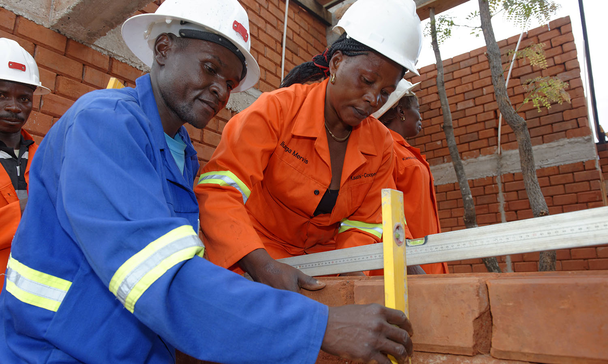

## Lavoro forzato 1930

La [Convenzione fondamentale dell’OIL sull’abolizione del lavoro forzato](https://www.ilo.org/rome/norme-del-lavoro-e-documenti/WCMS_152328/lang--it/index.htm) proibisce tutte le forme di lavoro forzato o obbligatorio definito come: “Ogni lavoro o servizio estorto a una persona sotto minaccia di una punizione o per il quale detta persona non si sia offerta spontaneamente”. Sono previste eccezioni per il lavoro svolto durante il servizio militare, il lavoro penitenziario e il lavoro obbligatorio in casi di forza maggiore quali guerre, incendi, terremoti.

La convenzione richiede inoltre che il lavoro forzato o obbligatorio sia punibile come reato penale e che gli Stati ratificanti garantiscano che le sanzioni pertinenti imposte dalla legge siano adeguate e strettamente applicate. La Convenzione è stata ratificata da 178 Stati membri dell’OIL. 

L’Italia ha ratificato la Convenzione nel 1934.

La Convenzione è stata ratificata da 178 Stati membri. L’Italia ha ratificato la Convenzione nel 1934.

---

## Libertà d’associazione e protezione del diritto sindacale 1948

La [Convenzione fondamentale dell’OIL sulla libertà sindacale e la protezione del diritto sindacale](https://www.ilo.org/rome/norme-del-lavoro-e-documenti/WCMS_152334/lang--it/index.htm) stabilisce il diritto per i datori di lavoro e i lavoratori di costituire e aderire ad organizzazioni di loro scelta senza previa autorizzazione, alla sola condizione di osservarne gli statuti.

Le organizzazioni dei datori di lavoro e dei lavoratori si organizzano liberamente e non possono essere soggette a scioglimento e/o a sospensione per via amministrativa.  Hanno inoltre il diritto di costituire federazioni e confederazioni così come di divenirne membri, e ogni organizzazione, federazione o confederazione ha il diritto di divenire membro di organizzazioni internazionali dei lavoratori e dei datori di lavoro. 

La Convenzione è stata ratificata da 155 Stati membri. L’italia ha ratificato la Convenzione nel 1958.

---

## Diritto di organizzazione e di negoziazione collettiva 1949

La [Convenzione fondamentale dell’OIL sul diritto di organizzazione e negoziazione collettiva](https://www.ilo.org/wcmsp5/groups/public/---europe/---ro-geneva/---ilo-rome/documents/normativeinstrument/wcms_152335.pdf) stabilisce che i lavoratori beneficino di un’adeguata protezione contro tutti gli atti di discriminazione tendenti a compromettere la libertà sindacale in materia di impiego. 

Tale principio si applica agli atti che abbiano lo scopo di:
- subordinare l’impiego di un lavoratore alla condizione che egli non aderisca ad un sindacato o smetta di far parte di un sindacato; 
- licenziare un lavoratore o arrecargli pregiudizio con ogni altro mezzo, a causa della sua affiliazione sindacale o della sua partecipazione ad attività sindacali al di fuori delle ore di lavoro, o, con il consenso del datore di lavoro, durante le ore di lavoro.

Le organizzazioni dei datori di lavoro e dei lavoratori devono beneficiare di un’adeguata protezione contro tutti gli atti di ingerenza delle une verso le altre, che si realizzino sia direttamente sia per mezzo di loro funzionari o membri, nella loro formazione, nel loro funzionamento e nella loro amministrazione.

La Convenzione assicura il diritto di negoziazione collettiva. Ogni Stato membro dell’OIL dovrà adottare le misure appropriate per incoraggiare la negoziazione tra le organizzazioni dei datori di lavoro e i sindacati, ai fini della regolamentazione dei termini e delle condizioni di lavoro attraverso la stipula di contratti collettivi.

La Convenzione è stata ratificata da 166 Stati membri. L’Italia ha ratificato la Convenzione nel 1958.

---

## Parità di retribuzione 1951

La [Convenzione fondamentale dell’OIL sull’uguaglianza di retribuzione](https://www.ilo.org/wcmsp5/groups/public/---europe/---ro-geneva/---ilo-rome/documents/normativeinstrument/wcms_152336.pdf) definisce la “retribuzione“ come il salario o il trattamento ordinario, di base o minimo, e tutti gli altri emolumenti, pagati direttamente o indirettamente, in moneta o in natura, dal datore di lavoro al lavoratore in ragione dell’impiego di quest’ultimo.

Con l’espressione «uguaglianza di retribuzione fra mano d’opera maschile e mano d’opera femminile per un lavoro di valore uguale» si riferisce ai tassi di retribuzione fissati senza discriminazione fondata sul sesso.

La Convenzione richiede agli Stati ratificanti di incoraggiare, con mezzi conformi ai metodi in vigore per la fissazione dei tassi di retribuzione, e, nella misura in cui ciò sia compatibile con detti metodi, assicurare la applicazione a tutti i lavoratori del principio dell’uguaglianza di retribuzione fra mano d’opera maschile e mano d’opera femminile per un lavoro di valore uguale.

La Convenzione è stata ratificata da 173 Stati membri. L’italia ha ratificato la Convenzione nel 1956.

---

## Abolizione del lavoro forzato 1957

La [Convenzione fondamentale dell’OIL sull’abolizione del lavoro forzato](https://www.ilo.org/wcmsp5/groups/public/---europe/---ro-geneva/---ilo-rome/documents/normativeinstrument/wcms_152687.pdf) completa la Convenzione n. 29 del 1930 e proibisce il lavoro forzato, incluso il lavoro forzato in carcere, e vieta la possibilità di ricorrervi sotto alcuna forma. Proibisce ogni forma di lavoro forzato o coatto come mezzo di coercizione o di educazione politica; come sanzione per aver espresso opinioni politiche o ideologiche; come metodo di mobilitazione della manodopera; come misura disciplinare sul lavoro; come sanzione per aver partecipato a scioperi o come misura di discriminazione 

Ogni Stato membro dell’Organizzazione Internazionale del Lavoro che ratifichi la presente convenzione si impegna a prendere efficaci misure per l’abolizione immediata e completa del lavoro forzato od obbligatorio.

La Convenzione è stata ratificata da 175 Stati membri. L’Italia ha ratificato la Convenzione nel 1968.

---

## Discriminazione sul lavoro 1958

La [Convenzione fondamentale dell’OIL sulla discriminazione (impiego e professione)](https://www.ilo.org/wcmsp5/groups/public/---europe/---ro-geneva/---ilo-rome/documents/normativeinstrument/wcms_152337.pdf) definisce la discriminazione come la distinzione, esclusione o preferenza fondata sulla razza, il colore, il sesso, la religione, l’opinione politica, la discendenza nazionale o l’origine sociale, che ha per effetto di negare o di alterare l’uguaglianza di possibilità o di trattamento in materia d’impiego o di professione. Nella definizione di discriminazione è ricompresa anche ogni altra distinzione, esclusioni o preferenza che abbia per effetto quello di negare o di alterare l’uguaglianza di possibilità o di trattamento in materia d’impiego o di professione.

La Convenzione copre la discriminazione in relazione all'accesso all'istruzione e alla formazione professionale e all'occupazione e richiede agli stati ratificanti di dichiarare e perseguire una politica nazionale finalizzata a promuovere, con metodi adeguati alle condizioni e alle prassi nazionali, parità di opportunità e trattamento in materia di occupazione e impiego, al fine di eliminare qualsiasi discriminazione in questi settori. 

La Convenzione è stata ratificata da 175 Stati membri. L’Italia ha ratificato la Convenzione nel 1963.

---

## Età minima di accesso al lavoro 1973

La [Convenzione fondamentale dell’OIL sull’età minima](https://www.ilo.org/wcmsp5/groups/public/---europe/---ro-geneva/---ilo-rome/documents/normativeinstrument/wcms_152686.pdf) fissa l'età minima generale in cui i bambini possono essere legalmente impiegati in attività lavorative a 15 anni (13 per i lavori leggeri) e 18 anni nel caso di lavori pericolosi. È prevista inoltre la possibilità di fissare inizialmente l'età minima generale a 14 anni (12 per lavori leggeri), nei paesi dove l'economia e le strutture educative non siano sufficientemente sviluppate. 

Gli Stati membri che ratificano la Convenzione si impegnano a perseguire una politica interna tendente ad assicurare l’abolizione effettiva del lavoro infantile e ad aumentare progressivamente l’età minima per l’assunzione all’impiego o al lavoro ad un livello che permetta agli adolescenti di raggiungere il più completo sviluppo fisico e mentale.

La Convenzione è stata ratificata da 171 Stati membri. L’Italia ha ratificato la Convenzione nel 1981.

---

## Dichiarazione OIL sui principi e i diritti fondamentali nel lavoro 1998

Nel giugno 1998 la Conferenza internazionale del Lavoro adottò la [Dichiarazione dell’OIL sui principi e i diritti fondamentali nel lavoro](https://www.ilo.org/wcmsp5/groups/public/---europe/---ro-geneva/---ilo-rome/documents/publication/wcms_151918.pdf) nella quale viene riaffermato l’impegno degli Stati membri dell’Organizzazione a “rispettare, promuovere e realizzare in buona fede” i principi relativi ai diritti fondamentali. Sono considerati diritti fondamentali nel lavoro: 
- la libertà di associazione e il riconoscimento effettivo del diritto di negoziazione collettiva;
- l’eliminazione di ogni forma di lavoro forzato o obbligatorio;
- l’abolizione effettiva del lavoro minorile e 
- l’eliminazione della discriminazione in materia di impiego e di occupazione

La Dichiarazione sui diritti fondamentali nel lavoro pone l’accento sull’obbligo per tutti i paesi membri di rispettare i principi fondamentali sanciti, indipendentemente dal fatto che abbiano o meno ratificato le relative convenzioni dell’ILO.

---

## Peggiori forme di lavoro minorile 1999

La [Convenzione fondamentale dell’OIL sulle peggiori forme di lavoro minorile](https://www.ilo.org/wcmsp5/groups/public/---europe/---ro-geneva/---ilo-rome/documents/normativeinstrument/wcms_152295.pdf) definisce "minore" una persona di età inferiore a 18 anni di età. 

La Convenzione richiede agli Stati ratificanti di eliminare le peggiori forme di lavoro minorile, tra cui: tutte le forme di schiavitù o pratiche simili alla schiavitù, come la vendita e il traffico di bambini, la schiavitù del debito e la servitù della gleba e lavoro forzato o obbligatorio, incluso il reclutamento forzato o obbligatorio di bambini da usare nei conflitti armati; prostituzione e pornografia infantile; usare i bambini per attività illecite, in particolare per la produzione e traffico di droga; e lavoro che potrebbe danneggiare la salute, la sicurezza o morale dei bambini. 

La Convenzione richiede agli Stati ratificanti di fornire l'assistenza diretta necessaria e appropriata per la rimozione di bambini dalle peggiori forme di lavoro minorile e per la loro riabilitazione e integrazione sociale. Richiede inoltre agli Stati di garantire l'accesso alla base gratuita istruzione e, laddove possibile e appropriato, formazione professionale per bambini affrancati dalle peggiori forme di lavoro minorile.

La Convenzione è stata ratificata da 182 Stati membri. L’Italia ratifica la Convenzione nel 2000.
