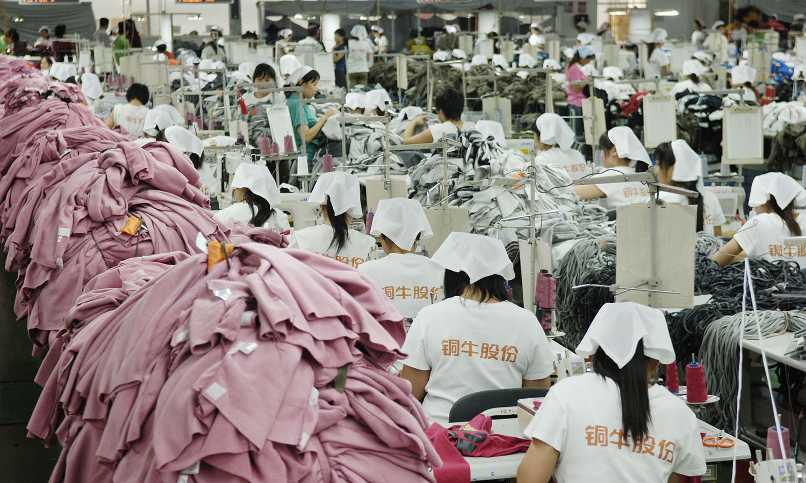
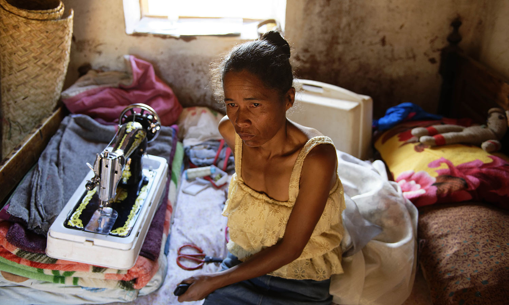

## Orario di lavoro nell’industria 1919

La [Convenzione sulla durata del lavoro (industria)](https://www.ilo.org/dyn/normlex/en/f?p=NORMLEXPUB:12100:0::NO::P12100_ILO_CODE:C001) n. 1, fissa l’orario di lavoro in 8 ore giornaliere e 48 ore settimanali. Sono previste delle eccezioni per i lavori manageriali e con carattere di riservatezza, per incarichi che hanno solitamente durata inferiore alle 8 ore nel resto della settimana (senza comunque superare le 9 ore totali in una giornata), per i lavori svolti su turni, per i quali sono previste diposizioni particolari. Inoltre, eccezioni sono previste in relazione a situazioni eccezionali di calamità o forza maggiore. Altri tipi di eccezioni possono essere discrezionalmente introdotte dagli stati, previa consultazione delle organizzazioni dei lavoratori. In tali casi, la paga per lo straordinario non può essere inferiore ad un quarto d’ora del regolare stipendio.

Ogni stato che ratifica la Convenzione deve dichiarare illegale il lavoro di una persona al di fuori dei termini orari previsti dalla stessa. 

La convenzione è stata ratificata da 52 Paesi, tra cui l’Italia (1924).

---

## Protezione della maternità 1919

La [Convenzione sulla protezione della maternità](https://www.ilo.org/dyn/normlex/en/f?p=NORMLEXPUB:12100:0::NO:12100:P12100_INSTRUMENT_ID:312148:NO) n. 3 sancisce il diritto al congedo per maternità nelle sei settimane successive al parto e il diritto a ricevere le prestazioni mediche necessarie. La lavoratrice ha diritto anche a richiedere un congedo preventivo nelle sei settimane prima del parto e ha diritto a mezz’ora per due volte al giorno. La Convenzione sancisce, inoltre, che ogni membro deve impegnarsi per far sì che quella della maternità non divenga una condizione soggetta a discriminazione d’impiego o di accesso allo stesso. Le integrazioni introdotte dalla [Convenzione del 1952 (n. 103)](https://www.ilo.org/dyn/normlex/en/f?p=NORMLEXPUB:12100:0::NO:12100:P12100_INSTRUMENT_ID:312298:NO) e dalla [Convenzione del 2000 (n. 183)](https://www.ilo.org/rome/norme-del-lavoro-e-documenti/WCMS_152284/lang--it/index.htm) estendono la durata minima del congedo retribuito, introducono il diritto a non effettuare lavori pericolosi e fissano i costi del congedo a carico della sicurezza sociale o tassazione generale. 

La Convenzione n. 3 è stata ratificata da 34 Stati membri, tra cui l’Italia (1952).

---

## Riposo settimanale nell’industria 1921

La [Convenzione sul riposo settimanale negli stabilimenti industriali](https://www.ilo.org/wcmsp5/groups/public/---europe/---ro-geneva/---ilo-rome/documents/normativeinstrument/wcms_153847.pdf), n. 14 prevede che il personale occupato in ogni stabilimento industriale, pubblico o privato, o nelle sue dipendenze, deve godere di una intera giornata (24 ore) di riposo settimanale, che dovrà essere quanto più possibile in concordanza con le festività locali. Eccezioni all’applicazione di questa norma sono considerati gli stabilimenti a carattere familiare. Ulteriori eccezioni sono da concordarsi con i rappresentanti dei lavoratori e devono essere cadenzatamente comunicate agli uffici OIL. I datori di lavoro devono impegnarsi a far conoscere questa norma ai propri lavoratori secondo i dettami previsti dalla Convenzione. 

La Convenzione è stata ratificata da 120 Stati membri, tra cui l’Italia (1924).

---

## Congedo retribuito 1936

La [Convenzione sul congedo retribuito](https://www.ilo.org/dyn/normlex/en/f?p=NORMLEXPUB:12100:0::NO:12100:P12100_INSTRUMENT_ID:312197:NO) n. 52 sancisce che ogni lavoratore ha il diritto alle ferie retribuite per un numero minimo pari a 6 giorni continuativi in un anno di lavoro. Questo periodo può essere dilazionato in più momenti, in base alle regole dei Paesi. La Convenzione sancisce, inoltre, che se un lavoratore viene licenziato dal datore di lavoro ha diritto a un risarcimento pari alle ferie maturate nell’arco di tempo lavorato. I datori di lavoro devono impegnarsi a far conoscere questa norma ai propri lavoratori secondo i dettami previsti dalla Convenzione. La Convenzione è stata integrata con quella che sancisce lo stesso principio per [Convenzione sul congedo dei lavoratori marittimi del 1936 (n. 54)](https://www.ilo.org/dyn/normlex/en/f?p=NORMLEXPUB:12100:0::NO:12100:P12100_INSTRUMENT_ID:312199:NO).

La Convenzione è stata ratificata da 54 Stati membri. L’Italia ha ratificato la Convenzione nel 1952 ma non è attualmente in vigore.

---

## Sviluppo delle risorse umane 1975

La [Convenzione sulla valorizzazione delle risorse umane](https://www.ilo.org/wcmsp5/groups/public/---europe/---ro-geneva/---ilo-rome/documents/normativeinstrument/wcms_153190.pdf), n. 142 prevede lo sviluppo di politiche e programmi di orientamento e formazione professionale per tutti i lavoratori, volti al miglioramento della capacità dell’individuo, nonché all’inserimento di questo nel sistema produttivo. Tale norma si applica indistintamente senza discriminazioni ed in considerazione delle aspirazioni di costui/costei in relazione ai bisogni della società. Al fine di applicare questa norma, ogni Paese dovrà provvedere alla creazione di sistemi scolastici e non, volti al raggiungimento di tale obiettivo e che includano anche informazioni circa la legislazione vigente in materia di lavoro, nonché le forme di contrattazione collettiva.

La Convenzione è stata ratificata da 68 Stati membri, tra cui l’Italia (1979).

---

## Lavoratori con responsabilità familiari 1981

La [Convenzione sui lavoratori con responsabilità famigliari](https://www.ilo.org/dyn/normlex/en/f?p=NORMLEXPUB:12100:0::NO:12100:P12100_INSTRUMENT_ID:312301:NO), n. 156 sancisce che i lavoratori che hanno responsabilità di cura, nei confronti di figli a carico o ad altri componenti della famiglia, devono poter esercitare i propri diritti senza essere discriminati e senza conflitto tra vita professionale e famigliare. La Convenzione ha carattere universale e punta a rendere equo il trattamento per uomini e donne con responsabilità familiari, aborrendo le discriminazioni lavorative che da tali responsabilità possono eventualmente scaturire, fino a comprendere il licenziamento. Gli stati ratificanti si impegnano a promulgare una serie di leggi utili alla sua applicazione e a coltivare il dialogo con le confederazioni di categoria su questo tema, al fine di raggiungerne tale scopo.

La Convenzione è stata ratificata da 44 Stati membri. L’Italia ad oggi non ha ratificato.

---

## Lavoro part-time 1994

La [Convenzione sul lavoro a tempo parziale](https://www.ilo.org/wcmsp5/groups/public/---europe/---ro-geneva/---ilo-rome/documents/normativeinstrument/wcms_185064.pdf), n. 175 dichiara che i lavoratori part-time devono godere della stessa protezione dei lavoratori a tempo pieno, relativamente a: libertà di associazione e negoziazione collettiva, salute e sicurezza sul lavoro, discriminazioni sul lavoro. Inoltre, viene rivendicata parità di diritti a livello di: protezione della maternità, licenziamento, congedi annuali retribuiti e per malattia. Viene, inoltre, dichiarata la necessità di adeguare i sistemi legali di sicurezza sociale degli stati, in modo che questi risultino equi per questi lavoratori. La Convenzione definisce chi sono i lavoratori a tempo parziale, in relazione a quelli a tempo pieno, ponendo come fondamentale il diritto al medesimo salario di base rispetto a questi ultimi. Gli Stati devono adottare misure che facilitino l’ingresso a tempo parziale, laddove questo sia conveniente sia al datore che al lavoratore, garantendo le protezioni suddette.

La Convenzione è stata ratificata da 17 Stati membri, tra cui l’Italia (2000).

---

## Lavoro a domicilio 1996

La [Convenzione sul lavoro a domicilio, n. 177](https://www.ilo.org/dyn/normlex/en/f?p=NORMLEXPUB:12100:0::NO:12100:P12100_INSTRUMENT_ID:312322:NO) sottoscrive la parità di trattamento tra lavoratori a domicilio e gli altri lavoratori dipendenti in relazione a: libertà di associazione e negoziazione collettiva; salute e sicurezza sul lavoro; discriminazione sul lavoro; età minima del lavoratore;  diritto alla formazione e alla protezione della maternità.

Essa definisce il lavoratore a domicilio come colui che effettua prestazioni di lavoro retribuite nella propria abitazione in maniera continuativa e su impiego di un datore di lavoro. 

Ogni stato si impegna a rivedere periodicamente la sua legislazione nazionale in materia, cooperando con gli organismi di rappresentanza del settore.

La Convenzione è stata ratificata da 10 Stati membri. L’Italia ad oggi non ha ratificato.

---

## Lavoratori domestici 2011

La [Convenzione sul lavoro dignitoso per le lavoratrici e i lavoratori domestici](https://www.ilo.org/wcmsp5/groups/public/---europe/---ro-geneva/---ilo-rome/documents/normativeinstrument/wcms_157904.pdf), n. 189 si pone come caposaldo per la protezione e la promozione dei diritti umani di tutti i lavoratori domestici, in particolare sancisce: libertà di associazione e negoziazione collettiva; salute e sicurezza sul lavoro; contrasto al lavoro forzato, alle discriminazioni sul lavoro e il ripudio del lavoro minorile. Tale convenzione è stata approvata nella consapevolezza del contributo significativo e del carattere sovranazionale di questo tipo di lavoro, al contempo soggetto a svalutazione e invisibilità. La Convenzione definisce il lavoro domestico come quello svolto “per una o più famiglie”. Essa specifica che i lavoratori domestici devono sottoscrivere un contratto, che definisce esattamente i loro diritti e doveri, prima di dar avvio all’attività lavorativa. Ogni Stato ratificante è tenuto a predisporre un corpus legislativo e/o di regolamenti per eliminare discriminazione e abusi, con ispezioni e sanzioni laddove necessario.

La Convenzione è stata ratificata da 27 Stati membri, tra cui l’Italia (2013).

---

## Eliminazione della violenza e delle molestie nel mondo del lavoro 2019

La [Convenzione sull’eliminazione della violenza e delle molestie nei luoghi di lavoro](https://www.ilo.org/wcmsp5/groups/public/---europe/---ro-geneva/---ilo-rome/documents/normativeinstrument/wcms_713379.pdf), n. 190 La Convenzione n.190 sancisce il diritto di tutti/e ad un mondo del lavoro libero dalla violenza e dalle molestie, ivi compreso la violenza e le molestie di genere. L’espressione “violenza e molestie” nel mondo del lavoro indica un insieme di pratiche e comportamenti inaccettabili che si prefiggano, causino o comportino un danno fisico, psicologico, sessuale o economico, include la violenza e le molestie di genere. La Convenzione si applica a tutti i settori, sia privati che pubblici, nell’economia formale e informale, in aree urbane o rurali. La Convenzione protegge i lavoratori e le altre persone nel mondo del lavoro. Si applica alla violenza e alle molestie che si verifichino durante il lavoro, in connessione con il lavoro o che scaturiscano dal lavoro. Le disposizioni della Convenzione devono essere attuate dagli Stati ratificanti attraverso leggi, regolamenti nazionali, contratti collettivi o altre misure conformi alle norme nazionali. Tra queste è previsto l’ampliamento/ adattamento delle misure esistenti in materia di salute e sicurezza sul lavoro affinché prevedano la violenza e le molestie.

Al momento la Convenzione non ha ancora avuto ratifiche. 
