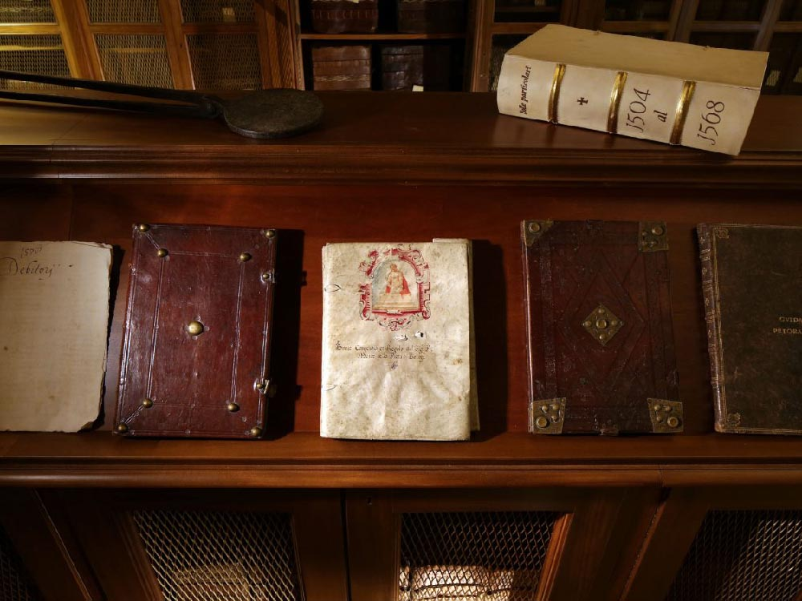
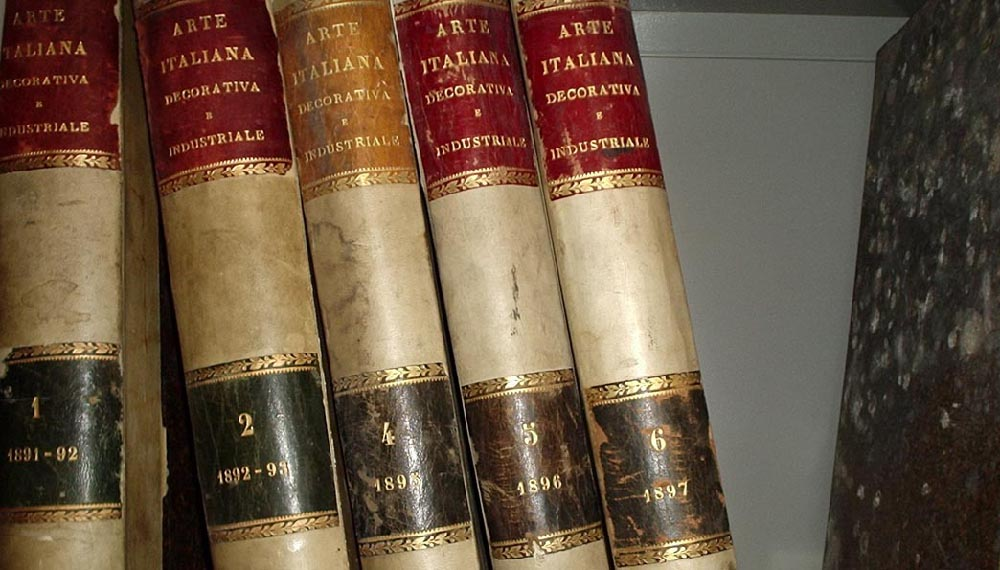
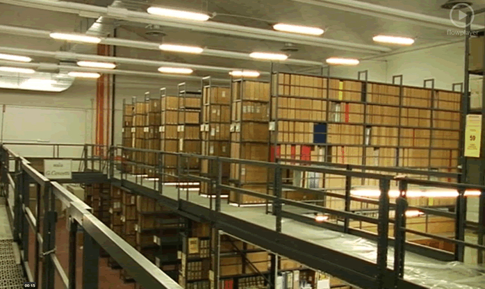

## Archivio storico UDI Bologna 

L’Archivio dell'Unione Donne in Italia (Udi) conserva presso la sua sede bolognese alcuni complessi archivistici di particolare importanza per ricostruire la storia dell’Associazione e dell’emancipazione femminile in generale, tra questi il Fondo Unione Donne in Italia (Udi) Bologna, il fondo fotografico ad esso afferente e il Fondo Unione Donne in Italia (Udi) Comitato regionale Emilia-Romagna. 

La storia dell’archivio nel suo complesso è legata all'istituzione del cosiddetto “Gruppo Archivio” avvenuta nel luglio 1987. Similmente a quanto si stava compiendo a livello nazionale, il Gruppo Archivio bolognese iniziò la ricognizione della documentazione già in possesso dell'Associazione e, parallelamente, si propose di reperirne dell‘altra, attraverso la richiesta diretta rivolta a circoli della provincia bolognese e singole attiviste. Nel giugno 1991, l’Archivio venne dichiarato "di notevole interesse storico" dalla Sovrintendenza archivistica e bibliografica dell’Emilia-Romagna e aprì le porte al pubblico il 7 giugno 1991, dopo un percorso pluriennale ispirato da più ampi mutamenti avvenuti a livello nazionale.

Il Fondo fotografico dell’UDI di Bologna, è costituito da oltre 3.000 fotografie che documentano iniziative e attività organizzate e sostenute dall'UDI a Bologna e in altre città italiane, dalla seconda metà degli anni Quaranta del Novecento fino ai primi anni Duemila. Le vere protagoniste del fondo sono le donne bolognesi, italiane e straniere, ritratte sia collettivamente che individualmente in spazi pubblici e privati. 

---

## Archivio Camera del Lavoro di Bologna – Associazione Paolo Pedrelli

La “Paolo Pedrelli” nacque a Bologna nel luglio del 1998, ad opera della Camera del lavoro metropolitana di Bologna e di tutte le categorie sindacali bolognesi. L’intento fu quello di conservare e ordinare il patrimonio archivistico e bibliotecario della Cgil di Bologna e della Cgil Emilia Romagna e di favorire unì ruolo attivo dell’Archivio nel dibattito culturale, dentro l’Organizzazione e nella città, sulle tematiche del lavoro e sulla memoria a queste collegata, che riguarda il contributo che il mondo del lavoro ha dato allo sviluppo sociale ed economico del nostro paese e in particolare della nostra regione.

Nonostante la Camera del Lavoro di Bologna sia nata nel 1893, il patrimonio dell’Archivio storico prende l’avvio dal dopoguerra, essendo andato perduto tutto il materiale archivistico precedente nel rogo fascista della notte del 7 agosto 1921, che distrusse ogni cosa nella sede di allora, in via D’Azeglio. È un patrimonio considerevole, riconosciuto dalla Soprintendenza archivistica e bibliografica dell’Emilia Romagna fra gli archivi “di rilevante interesse storico”, ed è composto da: oltre 400 riviste, 10 quotidiani, più di 100.000 foto, 121 bandiere, 32 gagliardetti, 2.000 manifesti, 10.000 libri, di cui 1.700 non catalogati, 55 Fondi, fra cui la gestione, congiunta con l’archivio dell’Istituto Gramsci, del Fondo Arbizzani.

L’attività di valorizzazione del patrimonio archivistico ha visto l’inventariazione su piattaforma Xdams sul portale “Città per gli Archivi”: sono quindi consultabili online gli inventari della Cdlm di Bologna, della Federazione italiana lavoratori tessili e abbigliamento (Filtea/Cgil) e del Sindacato scuola (Sns/Cgil) di Bologna. 

---

## Fondazione del Monte di Bologna e Ravenna

Il patrimonio archivistico della Fondazione del Monte di Bologna è assai cospicuo per consistenza, quasi un chilometro di documentazione proveniente da archivi prodotti e raccolti da soggetti produttori molteplici. Oltre ai fondi archivistici prodotti dai Monti di pietà di Bologna e Ravenna, si conservano archivi bancari (Banca del Monte di Bologna, Banca del Monte di Ravenna e Bagnacavallo, Banca del Monte di Bologna e Ravenna), l’archivio della Fondazione del Monte di Bologna e Ravenna, archivi familiari, di personalità e di impresa, collezioni e raccolte confluite per donazione e acquisizione presso la Fondazione negli ultimi vent'anni, costituendo un complesso di fonti di enorme valore per ricostruire la storia della città di Bologna tra Basso Medioevo ed Età Contemporanea. 

Tra i fondi conservati dall’Archivio Storico della Fondazione sono presenti raccolte e fondi fotografici, quantitativamente e qualitativamente importanti, tra questi: il Fondo Francesco Giovannini (Ferrara 1897 - Bologna 1964), la Raccolta di stereotipie di Gino Torresi, l’Archivio del fotografo bolognese N.G. Mazzanti, la Raccolta fotografica relativa al patrimonio artistico del Credito Romagnolo, la Raccolta di fotografie carducciane di padre Renato Santi, l’Archivio fotografico Banca del Monte, poi Fondazione del Monte di Bologna e Ravenna e l’Archivio dello Studio Fotografico Villani. Quest’ultimo complesso conserva una parte dell’ampia produzione dello studio fotografico bolognese, quella acquisita dalla Fondazione nei primi anni Duemila, ovvero oltre 50.000 fototipi tra positivi, negativi su lastra e pellicola, diapositive. Il materiale fotografico è costituito in particolare da riproduzioni di opere d’arte, da ritratti fotografici realizzati in studio e da fotografie che documentano stabilimenti, impianti, attività, prodotti e manodopera delle maggiori aziende bolognesi e non solo. 

---

## Museo del Patrimonio Industriale di Bologna, Sezione Biblioteca e Archivio

L’Archivio fotografico del Museo è costituito da due grandi nuclei, l’uno dedicato all’Aldini Valeriani e alla sua attività formativa, l’altro all’industria di Bologna e del suo territorio.

Risale al 1982 la costituzione del fondo Aldini, con le fotografie e gli album recuperati nella sede storica della Istituto, l’ex chiesa di S. Lucia, da tempo abbandonata. Sono 364 positivi, con autori quali Luigi Lanzoni, Antonio Sorgato, Fotografia dell’Emilia di Pietro Poppi, che documentano gli ambienti e la didattica degli anni 1865-1900. 

Il fondo denominato ITIAV (Istituto Tecnico Aldini-Valeriani) si è arricchito nel corso degli anni ed è composto da circa 400 positivi fotografici databili 1930-’60, nella maggior parte anonimi, anche se non mancano timbri Zagnoni, Villani, Fototecnica Bolognese. 

Proprio a quest’ultima, fondata nel 1953 da quattro fotografi ex Villani, è dedicato un ulteriore fondo, costituito da 1685 negativi su lastra in vetro. I loro servizi erano commissionati da industrie, ditte artigiane e commerciali, utilizzati per cataloghi di vendita e promozione.

Dalle attività di ricerca del Museo per allestimenti espositivi e pubblicazioni si è formato una raccolta di fotografie acquisite, in originale o in copia, dalle principali aziende locali. Non sono mancate anche donazioni di privati, come nel caso della Calzoni.

---

### Archivio Storico Regione Emilia-Romagna

Da fare